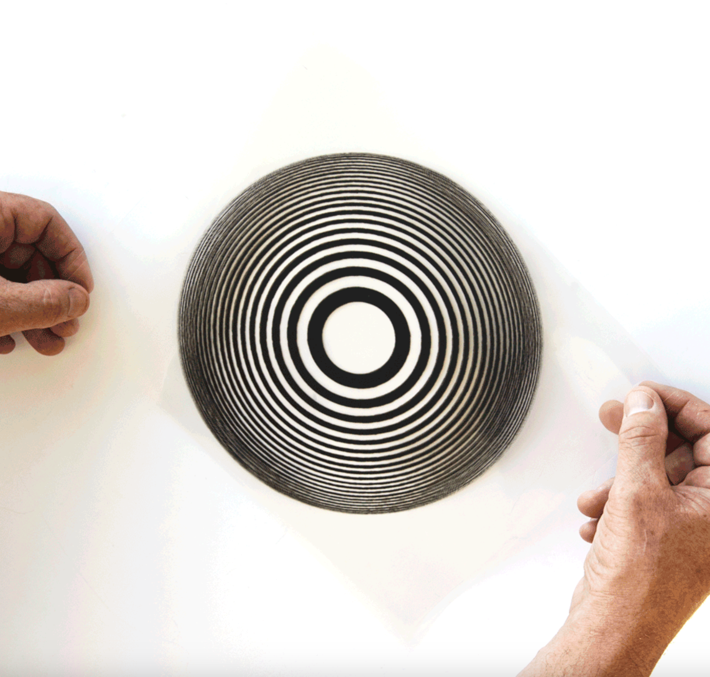
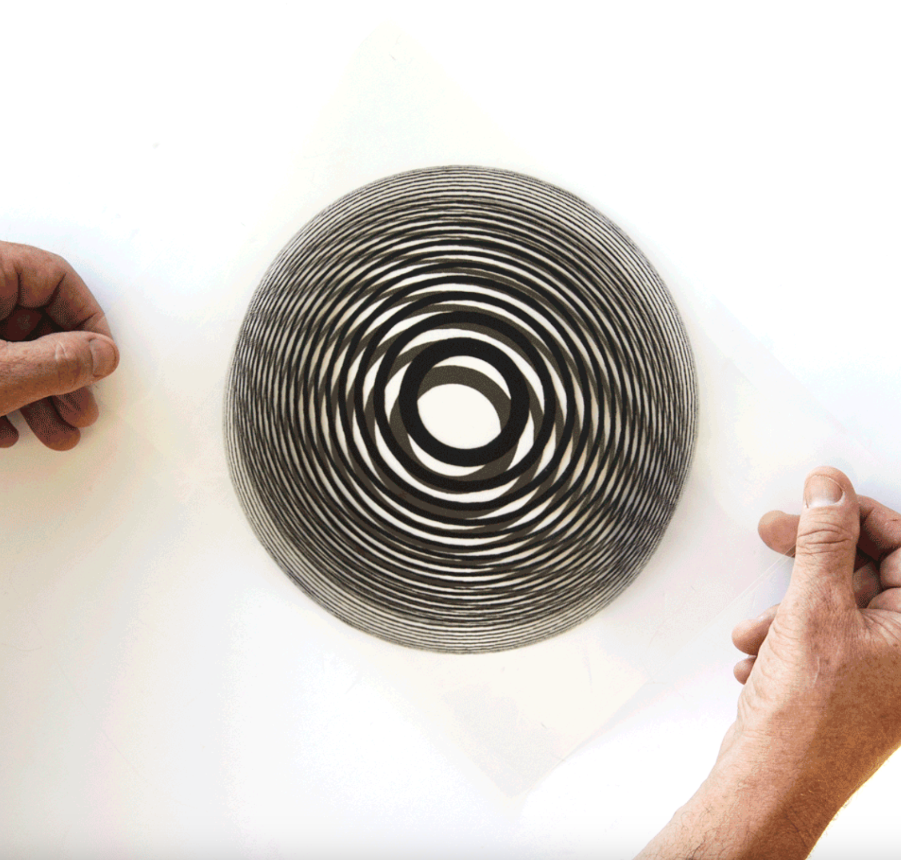
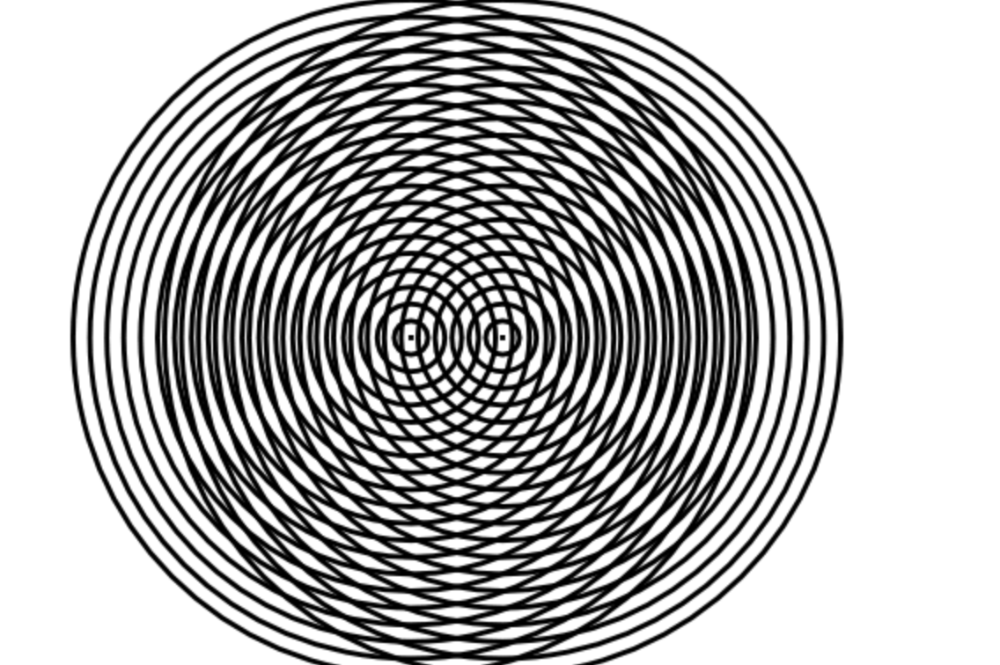
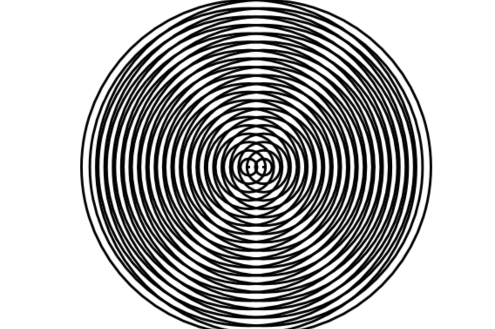
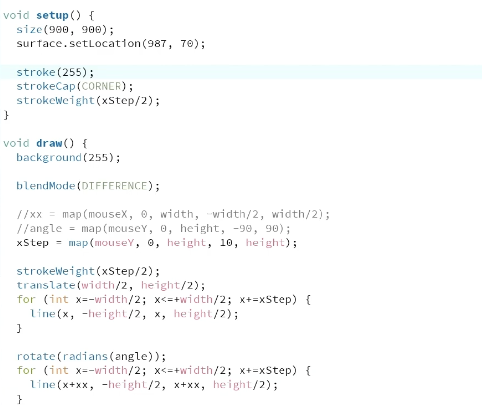
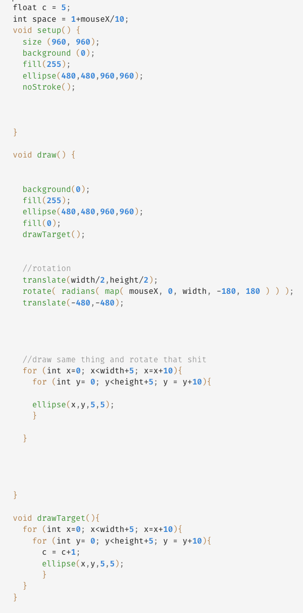

# zhhu0298_9103_tut2

## Quiz 8

### Part 1: Imaging Technique Inspiration

- **Imaging technique**: Moiré patterns
- **My ideas**: I would like to incorporate the overlapping line layers from Moiré patterns and the moving visual effect they create into our project. Specifically, I want one layer of repeated lines or any other shapes to stay still while another layer slowly shifts or follows the mouse. This can create a vibrating, wave-like effect from very simple shapes. I think this is beneficial because it fits the assignment’s interaction requirement clearly, and it also creates a strong visual result.
- **Inspiration examples**:
  - Example 1
  
  
  - Example 2
  
  
  - Example 3
  
  
  - Example 4
  
  

### Part 2: Coding Technique Exploration

- **Discussion**: The coding technique I would like to use is drawing repeated line layers with for loops, then slightly moving or rotating one layer using mouse input or time. This helps create the Moiré effect because the interference pattern appears when two similar line systems overlap but are not perfectly aligned.
- **Examples**:
  - Example 1 
    - Implementation: 
    [00:00-00:36](https://www.youtube.com/watch?v=CTa65yGcjFU)
    - Code:  
    
  - Example 2
    - Implementation: 
    [play it](https://openprocessing.org/sketch/456792)
    - Code:   
    

